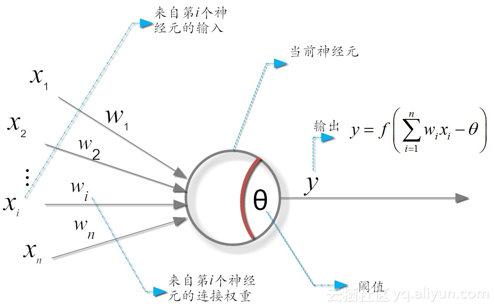

# 通过计算机模拟神经网络

## 神经网络的基本单元——神经元

人脑是一个高度复杂的、非线性的和并行的计算机器，它的基本组成成分是**神经元 (neuron)**。神经元简单来说是一种“简单处理单元”，接受来自其他神经元的信号并在超过了一个**阈值 (threshold)** 后会将兴奋传递给下一个神经元。因此神经元有三个基本元素：

1. 突触或连接链集（电流/信号搜集与变换）；
2. 加法器（电流/信号积累）；
3. 激活函数（非线性变换，将累加信号变换后输出，一般使用压制函数限制输出振幅）；

1943 年，McCulloch 与 Pitts 将上述神经元要素抽象为下图所示的简单模型，这就是著名的“M-P 神经元模型”。在这个模型中，神经元接收到来自个其它神经元传递过来的输入信号，这些输入信号通过带权重的连接对输入信号进行线性变换，神经元接收到的总输入与神经元的阈值进行比较，然后通过激活函数处理以产生神经元的输出。

## 神经元排列构成神经网络

如果把许多个神经元排成一排，并且将这一排一排的堆叠在一起就构成了简单的神经网络。神经网络中的层根据其所处位置，可以分为输入层、隐藏层、输出层。

* 输入层即数据输入模型的层，有些时候不认为输入层是神经网络的一部分，但输入层确定了输出的规模与类型。
* 输出层即模型输出结果的层，在回归任务中输出层负责输出一个或多个回归值，在分类任务中负责输出分类结果或类别置信度。
* 除去输入层、输出层以外的层均为隐藏层，有些神经网络不包含隐藏层，例如单层前馈神经网络。

即使如此，神经网络模型、算法繁多。一般来说，我们可以区分三种基本不同的网络结构：单层前馈网络、多层前馈网络以及递归网络。

